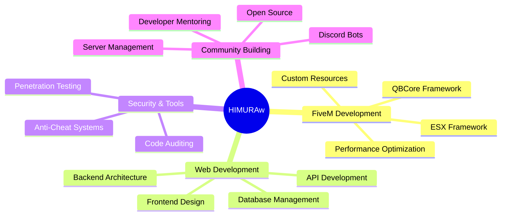

<p align="center"> 🚀 HIMURAw - Full-Stack Developer & FiveM Architect </p>

<div align="center">


[](https://git.io/typing-svg)

</div>

---

## 🎯 About Me

> **16-year-old visionary developer from Turkey**, transforming ideas into premium digital experiences that power communities worldwide.

```typescript
const HIMURAw = {
    location: "HIMURA  🇹🇷",
    age: 16,
    role: "Full-Stack Developer & FiveM Architect",
    language: ["Lua", "JavaScript", "Typescript", "CSS", "HTML", "C#"],
    tecnologia: ["React", "node.js", "discord.js", "express.js", "qb-core", "ex_extendet", "drizzle", "mysql", "postgresql", "mongodb", "arduino"]
    specializations: [
        "Premium FiveM Script Development",
        "Interactive UI/UX Design", 
        "Discord Bot Architecture",
        "Web designer"
    ],
    community: "PXDevelopment - 1K+ Members",
    motto: "Code with passion, build with purpose"
};
```

### 🌟 What Sets Me Apart

- 🎨 **Design-First Approach** — Every project starts with exceptional UI/UX
- ⚡ **Performance Obsessed** — Optimized code that scales beautifully
- 🛡️ **Security Minded** — Advanced protection with TCPASF suite
- 🤝 **Community Driven** — Building tools that empower thousands
- 🔄 **Continuous Innovation** — Always pushing the boundaries

---


## 🏆 GitHub Analytics

<div align="center">

  <div style="display: flex; justify-content: center; gap: 20px; flex-wrap: wrap;">
    
    
  </div>

  <br/>


<div style="display: flex; justify-content: center; gap: 40px; flex-wrap: nowrap; align-items: center;">


</div>


  <br/>

  <div style="text-align: center;">
    
  </div>

</div>


---


### 🏗️ Projects

| Project | Category | Tech Stack | Status |
|---------|----------|------------|--------|
| [`PX-Guard`](https://github.com/HIMURAw/PX-Guard) | 🎯 Guard System | JS + MongoDB | ✅ Active |
| [`Pixel-license`](https://github.com/HIMURAw/Pixel-license) | 💼 License System | JS + Lua | ✅ Active |
| [`Backdoor-scanner`](https://github.com/HIMURA/Backdoor-scanner) | 🎯 Guard System | Batchfile | ✅ Active |
| [`BotBase`](https://github.com/HIMURAw/BotBase) | 🏢 Base System | JS | ✅ Active |
| [`PXBotBaseTS`](https://github.com/HIMURAw/PXBotBaseTS) | 🏢 Base System | TS | ✅ Active |
[**📂 View All Repositories →**](https://github.com/HIMURAw?tab=repositories)

</div>

---

## 🛠️ Technology Arsenal

<div align="center">


## 🛠️ Technology Arsenal

<div align="center">

### 💻 Languages & Frameworks


### 🔧 Tools & Platforms


 <!-- QBCore resmi logo yok, renk seçtim -->

 <!-- Resmi logo yok, koyu mavi seçtim -->


### 🎯 Specializations



</div>


</div>

---

## 🌍 Community Impact

<div align="center">

### 🏢 PXDevelopment Community

[](https://discord.gg/pxdev)


</div>

- 👥 **500+** Active developers and roleplayers
- 🔧 **500+** Custom scripts distributed
- 🎯 **10+** Server partnerships worldwide  
- 📚 Daily tutorials and workshops
- 🤝 24/7 developer support

---


## 📊 Development Philosophy

<div align="center">

```ascii
╭─────────────────────────────────────────────╮
│  "Code is where passion meets logic"        │
│                                             │
│  ✨ Clean, clear, and maintainable code     │
│  🚀 Performance and optimization first      │
│  🎨 User experience always takes priority   │
│  🔐 Security baked into every design        │
│  🤝 Growing and evolving with the community │
╰─────────────────────────────────────────────╯
```

</div>


---

<div align="center">

### 🌐 Digital Presence

[](developmentpixel854@gmail.com)
[](https://discord.com/users/768372430631731210)
</div>

---

## 🏅 Recognition & Metrics

<div align="center">


[](https://github.com/HIMURAw?tab=followers)
[](https://github.com/HIMURAw)

</div>

---


**⭐ If you find my work valuable, consider starring my repositories!**

</div>

---

